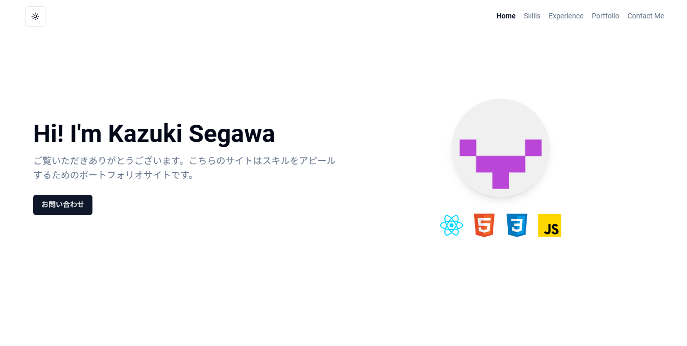

# segawa-site

ご覧いただきありがとうございます。これは私の React スキルをアピールするためのポートフォリオサイトです。 
レスポンシブ対応しているのでスマホからもご確認いただけます。

# URL

https://segawa-site.vercel.app/
Vercel を使って Web ページをデプロイしています。

# 使用技術

| カテゴリ     | 技術                                            |
| ------------ | ----------------------------------------------- |
| **Frontend** | TypeScript, React(Vite), TailwindCSS, shadcn/ui |
| **Deploy**   | Vercel                                          |

# 機能一覧

- **React Hook Form** - フォーム管理用ライブラリ
- **React Scroll** - スクロールアニメーションのサポート
- **Framer Motion** - アニメーションライブラリ
- **EmailJS** - フォームからのメール送信機能
